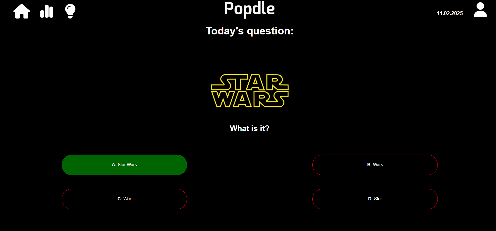
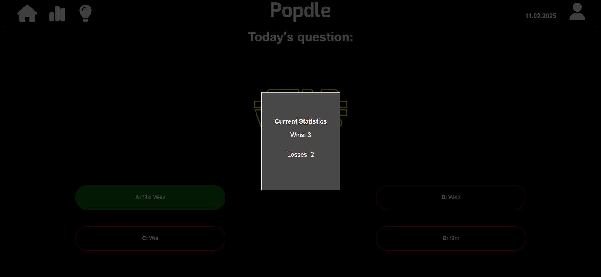
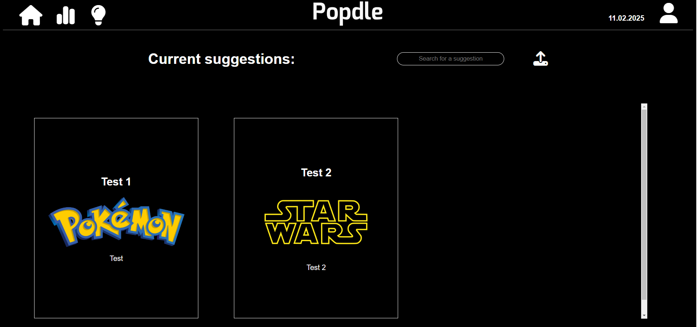
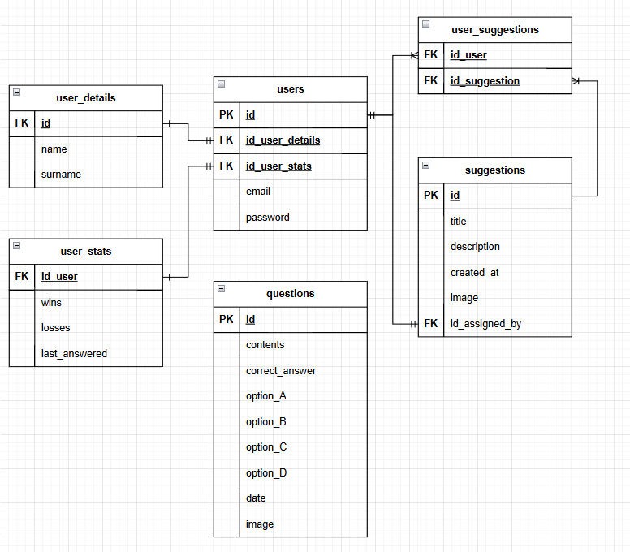

# Popdle (projekt - Wstęp do Programowania Aplikacji Internetowych)

Popdle to aplikacja internetowa, w której pozwala testować użytkownikom swoją wiedzę na temat popkultury!
Codziennie pojawiają się nowe pytania

## Zrzuty ekranu

## Funkcjonalność
- Codziennie nowe pytanie dla użytkowników.
- Możliwość zgadywania odpowiedzi.
- Statystyki wygranych i przegranych.
- Podgląd sugestii na nowe pytania i franczyzy.
- Możliwość dodawania własnych sugestii franczyz i pytań.

## Technologie

- HTML/CSS - Frontend
- Php - Backend
- PostgreSQL - baza danych
- JavaScript / FetchAPI - zarządzanie danymi

## ERD

